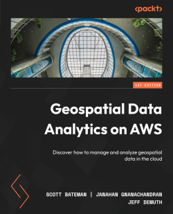
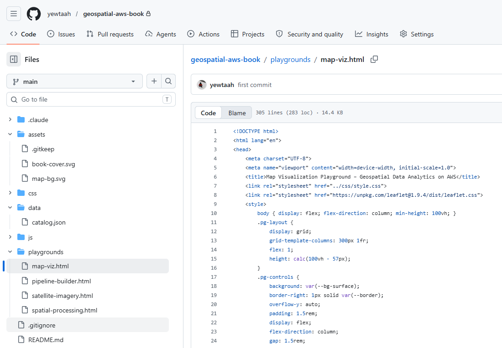

<div align="center">



# Geospatial Data Analytics on AWS

**The companion site for the Packt book on cloud-native geospatial engineering.**

[**Live Site**](https://yewtaah.github.io/geospatial-aws-book/) &nbsp;·&nbsp; [**Buy on Amazon**](https://www.amazon.com/Geospatial-Data-Analytics-AWS-geospatial/dp/1804613827/) &nbsp;·&nbsp; [**Read on O'Reilly**](https://www.oreilly.com/library/view/geospatial-data-analytics/9781804613825/)

</div>

---

## What's in the book

400+ pages covering the full stack of cloud-native geospatial work — from raw data ingestion to production-ready AWS architectures. Real examples, real data, real pipelines.

- AWS geospatial services and infrastructure patterns
- Data ingestion pipelines with Lambda, Glue, and S3
- Cloud-Optimized GeoTIFFs, STAC, and open standards
- Spatial analysis and machine learning on SageMaker
- Visualization with QuickSight and open-source tools

> *Yes, that's a real Athena query against a stadiums table. Houston Astros made the cut.*


---

## The site

The companion site is a static GitHub Pages app with interactive in-browser playgrounds — no AWS account required to explore the concepts.



**Playgrounds:**
| Playground | Concepts |
|---|---|
| Spatial Data Processing | Buffer, dissolve, convex hull, Voronoi — live in-browser |
| Map Visualization | Layer styling, base maps, interactive controls |
| Satellite Imagery Analysis | Sentinel-2 band combinations and spectral indices |
| Pipeline Builder | Drag-and-drop AWS ETL architecture designer |

---

## The authors

Three AWS solutions architects who spent a lot of time together in AWS console sessions, conference rooms, and at least one very good lunch.

<br>


*Scott and Jeff celebrating the manuscript at Fat Cat Cafe. Jana was probably on a call.*

<br>

|  |  |  |
|:---:|:---:|:---:|
| **Scott Bateman** | **Janahan Gnanachandran** | **Jeff DeMuth** |
| Energy Innovation Leader, EY — formerly Principal SA, AWS | Principal SA, AWS — Analytics, AI/ML & Sustainability | Solutions Architect, AWS — Geospatial Community |

---

## Running locally

```bash
git clone https://github.com/yewtaah/geospatial-aws-book.git
cd geospatial-aws-book

# Python
python -m http.server 8000

# or Node
npx http-server
```

Then open `http://localhost:8000`.

---

## Repo structure

```
geospatial-aws-book/
├── index.html              # Landing page
├── data-samples.html       # Free dataset browser
├── css/style.css
├── js/main.js
├── data/catalog.json       # Dataset catalog
├── assets/                 # Images
└── playgrounds/
    ├── spatial-processing.html
    ├── map-viz.html
    ├── satellite-imagery.html
    └── pipeline-builder.html
```

---

## Deployment

Pushes to `main` deploy automatically to GitHub Pages:
`https://yewtaah.github.io/geospatial-aws-book/`

---

<div align="center">

*© 2026 Scott Bateman, Janahan Gnanachandran & Jeff DeMuth — Published by Packt*


*Mandatory Texas author photo.*

</div>
